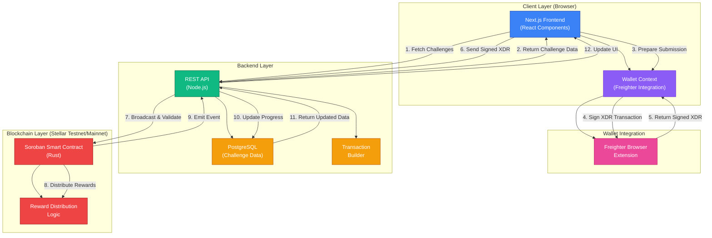

# Plearn System Architecture

> **Learn. Solve. Earn.** — A decentralized challenge platform built on Stellar

This document describes the three-phase architecture of Plearn and how each component integrates to deliver a seamless Web3 learning experience.

## Table of Contents

- [System Overview](#system-overview)
- [Architecture Diagram](#architecture-diagram)
- [Phase 1: Soroban Smart Contracts](#phase-1-soroban-smart-contracts)
- [Phase 2: Backend REST API](#phase-2-backend-rest-api)
- [Phase 3: Frontend (Next.js)](#phase-3-frontend-nextjs)
- [Challenge Submission Workflow](#challenge-submission-workflow)
- [Wallet Connection & XDR Signing Flow](#wallet-connection--xdr-signing-flow)
- [Data Flow](#data-flow)
- [Integration Points](#integration-points)

---

## System Overview

Plearn is a three-phase Web3 application that enables developers to solve coding challenges and earn token rewards on the Stellar blockchain:

| Phase | Layer | Technology | Responsibility |
|-------|-------|-----------|-----------------|
| **1** | **Smart Contract** | Soroban (Rust/Stellar) | Challenge engine, reward distribution, on-chain state |
| **2** | **Backend API** | Node.js / REST | Challenge data, submission validation, transaction preparation |
| **3** | **Frontend** | Next.js + React + TypeScript | User interface, wallet management, transaction signing |

---

## Architecture Diagram



---

## Phase 1: Soroban Smart Contracts

**Location:** `contracts/` (separate repository)

### Responsibilities
- **Challenge Engine:** Stores challenge metadata and validation rules
- **Reward Distribution:** Distributes PLN tokens upon successful submission
- **On-Chain State:** Maintains immutable records of completions and rewards
- **Transaction Validation:** Verifies submission authenticity before distributing rewards

### Key Components
- `Challenge` contract: Challenge registration and management
- `Reward` contract: Token distribution and balance tracking
- `ChallengeValidator`: Business logic for submission verification

### Network
- **Testnet:** Test SDF Network ; September 2015
- **Mainnet:** Public Global Stellar Network ; September 2015

### Integration with Other Phases
- Receives unsigned transactions from Phase 2 (Backend)
- Executes reward distribution when Phase 2 broadcasts the signed transaction
- Emits events that Phase 2 listens for and updates to the database

---

## Phase 2: Backend REST API

**Location:** `backend/` (separate repository)

### Responsibilities
- **Challenge Repository:** Serves challenge data to the frontend
- **Submission Validation:** Validates user solutions before submission to the blockchain
- **Transaction Preparation:** Builds unsigned XDR transactions for wallet signing
- **Progress Tracking:** Records user progress and reward history in the database
- **Wallet Security:** Never touches user private keys; all signing is client-side

### Key Endpoints

#### Challenge Endpoints
```
GET  /challenges                  # List all challenges
GET  /challenges?difficulty=X     # Filter by difficulty
GET  /challenges/:id              # Get challenge details
```

#### User Progress
```
GET  /progress                    # Get current user progress
GET  /progress?address=:address   # Get progress for specific address
```

#### Leaderboard
```
GET  /leaderboard                 # Get ranked top solvers
```

#### Submission
```
POST /submit
  Body: {
    challengeId: string
    address: string               # User's Stellar wallet address
    signedXdr: string            # Signed by Freighter
  }
  Response: {
    transactionHash: string
    reward: number
    success: boolean
  }
```

### Database Schema (Conceptual)
```
Challenges
├── id (uuid)
├── title (string)
├── description (text)
├── difficulty (enum: BEGINNER, INTERMEDIATE, ADVANCED)
├── reward (numeric)
└── createdAt (timestamp)

UserProgress
├── id (uuid)
├── address (string) - Stellar public key
├── challengeId (uuid)
├── completed (boolean)
├── reward (numeric)
├── submittedAt (timestamp)
└── transactionHash (string)

Leaderboard (view)
├── address
├── totalChallengesSolved (count)
└── totalRewardsEarned (sum)
```

### Security Considerations
- Validates challenge existence before creating transactions
- Rate-limiting on `/submit` endpoint
- Transaction signatures verified before broadcasting
- No sensitive keys stored on backend

---

## Phase 3: Frontend (Next.js)

**Location:** `PLEarn-Frontend/` (this repository)

### Responsibilities
- **User Interface:** Challenge browsing, filtering, and submission
- **Wallet Management:** Connect/disconnect Freighter wallet
- **Transaction Signing:** Initiate XDR signing via Freighter
- **Progress Display:** Show user achievements and leaderboard ranking
- **Client-Side Validation:** Validate input before submission to backend

### Architecture

#### App Router Structure
```
src/app/
├── layout.tsx                    # Root layout with WalletProvider
├── page.tsx                      # Landing page
├── challenges/
│   ├── page.tsx                  # Challenge list with filters
│   └── [id]/page.tsx             # Challenge detail + submission form
├── leaderboard/page.tsx          # Global leaderboard
└── dashboard/page.tsx            # User personal dashboard
```

#### Components
- **Navbar:** Navigation and wallet button
- **WalletButton:** Connect/disconnect UI
- **ChallengeCard:** Challenge preview in list
- **DifficultyBadge:** Visual difficulty indicator
- **DifficultyFilter:** Filter controls on challenges page
- **SubmitSolution:** Form for code submission
- **ProgressStats:** User stats and completed challenges

#### Context & State
- **WalletContext:** Global wallet state (address, connection status, signing)
- React hooks for component-level state

#### API Layer
```typescript
// src/lib/api.ts
getChallenges(difficulty?)        # Fetch challenges
getChallenge(id)                  # Fetch single challenge
getLeaderboard()                  # Fetch leaderboard
getProgress(address?)             # Fetch user progress
submitSolution(id, address, xdr)  # Submit signed solution
```

### Tech Stack
- **Framework:** Next.js 14 (App Router)
- **Language:** TypeScript (strict mode)
- **Styling:** Tailwind CSS
- **Wallet:** @stellar/freighter-api
- **Blockchain:** @stellar/stellar-sdk
- **Icons:** Lucide React

---

## Challenge Submission Workflow

The complete flow from user submission to reward distribution:

```
┌─────────────────────────────────────────────────────────────────────────────┐
│                     CHALLENGE SUBMISSION WORKFLOW                            │
└─────────────────────────────────────────────────────────────────────────────┘

1. USER INITIATES SUBMISSION
   └─> Frontend displays challenge details
   └─> User clicks "Submit Solution"
   └─> Solution code is entered in form

2. FRONTEND VALIDATION
   └─> Check solution is not empty
   └─> Check wallet is connected
   └─> Show loading state

3. REQUEST UNSIGNED TRANSACTION
   └─> Frontend → Backend: GET /transaction-unsigned
       {
         challengeId: "ch-123",
         address: "GXXXXX..."
       }
   └─> Backend: Validate challenge exists & user eligibility
   └─> Backend: Build unsigned XDR transaction
   └─> Backend → Frontend: Return unsigned XDR

4. SIGN TRANSACTION (IN WALLET)
   └─> Frontend calls Freighter: signTransaction(xdr)
   └─> Freighter: Show signing confirmation in browser extension
   └─> User approves in Freighter UI
   └─> Freighter → Frontend: Return signed XDR
   └─> Private key never leaves Freighter

5. SUBMIT SIGNED TRANSACTION
   └─> Frontend → Backend: POST /submit
       {
         challengeId: "ch-123",
         address: "GXXXXX...",
         signedXdr: "AAAAAgAAAABjPT..."
       }
   └─> Backend: Verify signature validity
   └─> Backend: Broadcast signed XDR to Stellar network

6. BLOCKCHAIN EXECUTION
   └─> Stellar network receives transaction
   └─> Soroban contract executes
   └─> Contract validates challenge completion
   └─> Contract transfers reward tokens to user address
   └─> Emits success event with transaction hash

7. BACKEND UPDATES PROGRESS
   └─> Backend: Listen for blockchain confirmation
   └─> Backend: Record in database
       {
         address: "GXXXXX...",
         challengeId: "ch-123",
         reward: 100,
         transactionHash: "abc123..."
       }
   └─> Leaderboard updated automatically

8. FRONTEND UPDATES UI
   └─> Frontend polls for transaction status (optional WebSocket in future)
   └─> Success message displayed to user
   └─> Progress stats updated
   └─> Challenge marked as "Completed"
```

### Error Scenarios

| Scenario | Handling |
|----------|----------|
| Wallet not connected | Show "Connect wallet" prompt |
| Solution validation fails | Display error message, allow retry |
| User already completed challenge | Backend rejects, show message |
| Transaction signing rejected by user | Freighter returns error, frontend catches |
| Network error during broadcast | Retry logic, show status |
| Insufficient funds for gas | Freighter prevents signing |

---

## Wallet Connection & XDR Signing Flow

### Freighter Integration Architecture

```
┌───────────────────────────────────────────────────────────────────┐
│                    WALLET CONNECTION FLOW                         │
└───────────────────────────────────────────────────────────────────┘

1. USER INITIATES CONNECTION
   └─> Frontend: User clicks "Connect Wallet" button
   └─> WalletContext: Calls connect() function

2. CHECK FREIGHTER AVAILABILITY
   └─> WalletContext: Calls isConnected() from @stellar/freighter-api
   └─> If Freighter not found:
       └─> Show: "Freighter wallet extension not installed"
       └─> Provide link to install Freighter
   └─> If found: Continue

3. REQUEST PUBLIC KEY PERMISSION
   └─> WalletContext: Calls getPublicKey()
   └─> Freighter: Shows permission prompt in browser
   └─> User approves in Freighter UI
   └─> Freighter: Returns public key (e.g., "GXXXXX...")

4. STORE PUBLIC KEY IN CONTEXT
   └─> WalletContext: setAddress(publicKey)
   └─> React Context updated
   └─> All components re-render
   └─> WalletButton shows: "Connected: GXXXXX..."

5. MAINTAIN SESSION
   └─> Public key persisted in browser memory
   └─> User remains connected until:
       └─> Explicit disconnect (button click)
       └─> Page refresh (session lost)
       └─> User logout
```

### XDR Signing Architecture

```
┌───────────────────────────────────────────────────────────────────┐
│                    XDR SIGNING FLOW                               │
└───────────────────────────────────────────────────────────────────┘

UNSIGNED XDR PREPARATION (Backend)
├─> Create transaction envelope
├─> Set source account = user's public key
├─> Add operations (invoke contract)
├─> Set sequence number
├─> Set network passphrase (testnet/mainnet)
├─> Set timeout
└─> Do NOT sign yet
    └─> Result: Unsigned XDR string

CLIENT-SIDE SIGNING (Browser + Freighter)
├─> Frontend receives unsigned XDR
├─> Frontend calls: signTransaction(xdr, { networkPassphrase })
├─> Freighter detects wallet has been asked to sign
├─> Freighter shows: "Approve Transaction" dialog
│   ├─> Transaction details displayed
│   ├─> User can review operations
│   ├─> User can reject
├─> User clicks "Approve"
├─> Freighter signs with user's private key (never leaves Freighter)
├─> Freighter returns: Signed XDR string
└─> Private key never exposed to webpage

VERIFICATION & BROADCAST (Backend)
├─> Backend receives signed XDR
├─> Backend verifies signature matches user's public key
├─> Backend broadcasts to Stellar network
├─> Network validates and executes
└─> On success:
    └─> Transaction hash returned
    └─> Event emitted
    └─> Database updated
```

### Security Guarantees

✓ **User Private Keys Never Leave Freighter**
- Signing happens inside Freighter extension sandbox
- Frontend only sees public key and signed transactions

✓ **No Secret Keys Stored**
- Backend doesn't store or see private keys
- Frontend doesn't store or see private keys
- Only Freighter stores private keys (encrypted)

✓ **Transaction Validation**
- Backend validates all transaction parameters
- Network validates all signatures before execution
- Soroban contract validates business logic

✓ **Replay Attack Prevention**
- Stellar uses sequence numbers
- XDR includes network passphrase (testnet vs mainnet)
- Timestamps prevent replays across time

---

## Data Flow

### Challenge Browsing Flow

```
User → Frontend: /challenges
  ↓
Frontend → Backend: GET /challenges?difficulty=BEGINNER
  ↓
Backend → Database: Query challenges table
  ↓
Database → Backend: Return challenge list
  ↓
Backend → Frontend: 200 OK + Challenge[]
  ↓
Frontend → User: Display cards with filters
```

### User Progress Flow

```
Connected User → Frontend: View /dashboard
  ↓
Frontend → WalletContext: Get current address
  ↓
Frontend → Backend: GET /progress?address=GXXXXX...
  ↓
Backend → Database: Query user progress + aggregate stats
  ↓
Database → Backend: UserProgress data
  ↓
Backend → Frontend: 200 OK + ProgressData
  ↓
Frontend → User: Display stats and completed challenges
```

### Leaderboard Flow

```
User → Frontend: View /leaderboard
  ↓
Frontend → Backend: GET /leaderboard
  ↓
Backend → Database: SELECT * FROM leaderboard (cached view)
  ↓
Database → Backend: Top solvers + stats
  ↓
Backend → Frontend: 200 OK + LeaderboardEntry[]
  ↓
Frontend → User: Display ranked list
```

---

## Integration Points

### Frontend ↔ Backend Integration

**Environment Variables** (frontend must set these):
```
NEXT_PUBLIC_BACKEND_URL=http://localhost:3001
NEXT_PUBLIC_STELLAR_NETWORK=testnet
NEXT_PUBLIC_CONTRACT_ID=CB...
```

**Request Flow:**
1. Frontend makes typed HTTP requests via `src/lib/api.ts`
2. Backend validates and processes requests
3. Backend returns typed JSON responses
4. Frontend caches responses with Next.js `revalidate`

**Error Handling:**
- Backend returns appropriate HTTP status codes
- Frontend displays user-friendly error messages
- Network errors trigger retry logic

### Backend ↔ Blockchain Integration

**Wallet Configuration:**
```javascript
signTransaction(xdr, {
  networkPassphrase: "Test SDF Network ; September 2015" // testnet
  // OR
  networkPassphrase: "Public Global Stellar Network ; September 2015" // mainnet
})
```

**Transaction Submission:**
1. Backend builds XDR transaction
2. Frontend signs XDR via Freighter
3. Backend broadcasts signed XDR to Stellar network
4. Stellar network executes Soroban contract

**Event Listening:**
- Backend polls for transaction confirmation
- Or uses Stellar event stream (future optimization)
- Updates database when confirmed

### Frontend ↔ Wallet Integration

**WalletContext** provides:
```typescript
interface WalletState {
  address: string | null;           // User's Stellar public key
  connected: boolean;               // Connection status
  connecting: boolean;              // Loading state during connect
  connect: () => Promise<void>;     // Initiate Freighter connection
  disconnect: () => void;           // Clear local state
  signTx: (xdr: string) => Promise<string>; // Sign transaction
}
```

**Usage in Components:**
```typescript
const { address, connected, signTx } = useWallet();
// Use in forms, displays, and submission logic
```

---

## Deployment & Environment

### Frontend Deployment Checklist
- [ ] Environment variables configured (backend URL, network, contract ID)
- [ ] Freighter extension available in browser
- [ ] Backend API accessible
- [ ] Next.js build successful (`npm run build`)
- [ ] No console errors on page load

### Backend Deployment Checklist
- [ ] Database migrations run
- [ ] Stellar network configured (testnet or mainnet)
- [ ] Contract ID verified
- [ ] Rate limiting configured
- [ ] Error logging configured

### Blockchain Deployment Checklist
- [ ] Soroban contracts deployed to network
- [ ] Contract IDs updated in frontend `.env`
- [ ] Network passphrase correct
- [ ] Test transactions successful

---

## Future Architecture Improvements

- **WebSocket for Real-Time Updates:** Replace polling with live transaction status
- **Caching Layer:** Redis for leaderboard and challenge data
- **Off-Chain Indexing:** Faster leaderboard queries without blockchain polling
- **Microservices:** Separate challenge service, progress service, reward service
- **Mobile Apps:** Native iOS/Android using same REST API
- **Batch Processing:** Process multiple submissions efficiently
- **Analytics:** User engagement and challenge difficulty metrics

---

## Troubleshooting Guide

### Frontend Cannot Connect to Backend
- Check `NEXT_PUBLIC_BACKEND_URL` in `.env.local`
- Verify backend server is running
- Check browser console for CORS errors
- Ensure backend allows requests from frontend origin

### Freighter Not Detected
- Install Freighter extension from https://freighter.app
- Refresh page after installation
- Check browser console for Freighter API errors

### Transaction Signing Fails
- Ensure Freighter is unlocked
- Check Freighter account has funds for gas
- Verify network passphrase matches user's Freighter setting
- Check XDR transaction format is valid

### Challenge Submission Rejected
- Verify wallet is connected
- Check challenge ID is valid
- Ensure backend is accessible
- Check backend logs for validation errors

---

## Document Versioning

| Version | Date | Changes |
|---------|------|---------|
| 1.0 | 2026-07-20 | Initial architecture documentation |

### When to Update This Document
- Major API changes
- New components added
- Architecture refactoring
- New deployment procedures
- Security improvements

---

**Last Updated:** 2026-07-20  
**Maintained By:** Plearn Developers  
**License:** MIT © Plearn Contributors
